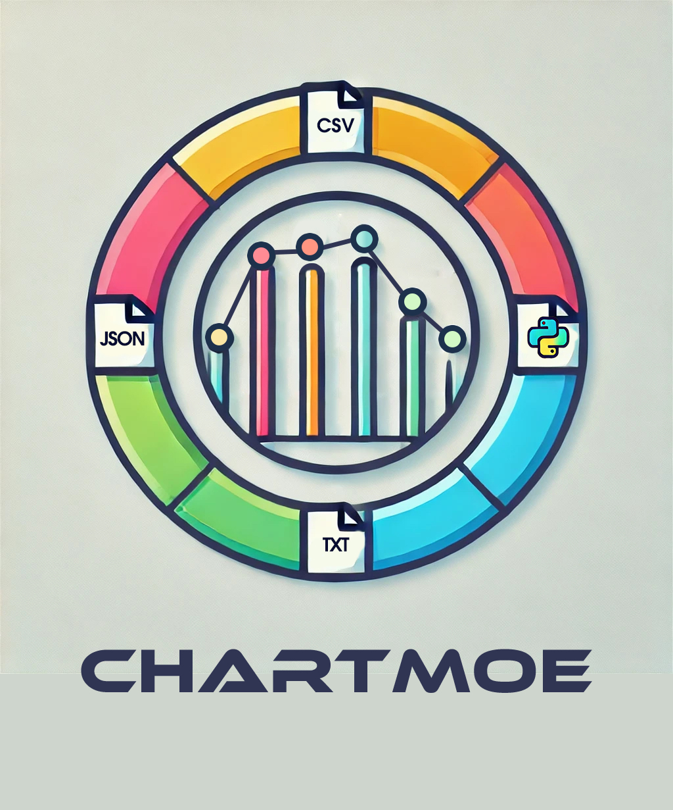
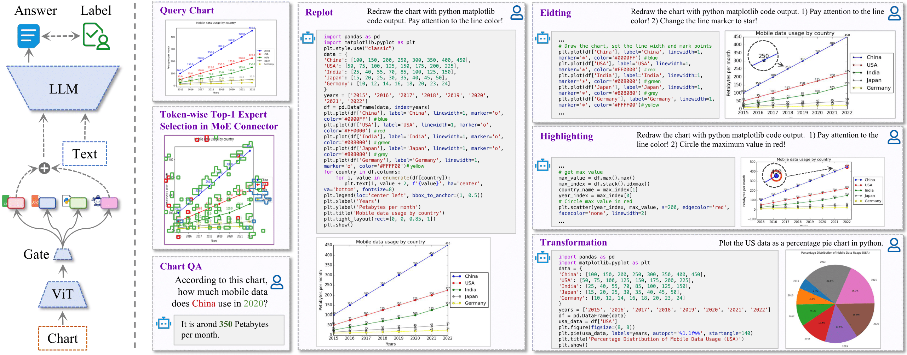
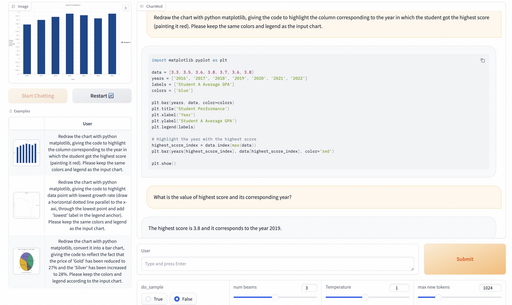

<div align="center">

<h1>ChartMoE</h1>
<h3>Mixture of Diversely Aligned Expert Connector for Chart Understanding</h3>

[Zhengzhuo Xu](https://github.com/XuZhengzhuo)<sup>1,2\*</sup>, [Bowen Qu](https://github.com/Coobiw)<sup>1,3\*</sup>, Yiyan Qi<sup>1\*</sup>,  Sinan Du<sup>2</sup>, Chengjin Xu<sup>1</sup>, Chun Yuan<sup>2</sup>, Jian Guo<sup>1,4</sup>

<sup>1</sup> International Digital Economy Academy (IDEA),
<sup>2</sup> Tsinghua University,
<sup>3</sup> Peking University,

<sup>4</sup> Hong Kong University of Science and Technology, Guangzhou

<b>ICLR 2025 Oral</b>

(\* equal contribution)

[](https://arxiv.org/abs/2409.03277)
[](https://chartmoe.github.io/)
[](https://huggingface.co/IDEA-FinAI/chartmoe)
[](https://huggingface.co/datasets/Coobiw/ChartMoE-Data)

*If you have any question, feel free to contact [📧](mailto:brian.bw.qu@gmail.com).*

</div>



**ChartMoE** is a multimodal large language model with Mixture-of-Expert connector for advanced chart 1)understanding, 2)replot, 3)editing, 4)highlighting and 5)transformation. 

## News
- 2025.2.16: ChartMoE-Data has been released at [🤗](https://huggingface.co/datasets/Coobiw/ChartMoE-Data). Please download it according to [our instruction](#download-and-organize-the-chartmoe-data).
- 2025.2.15: Training codes and recipes are released! Please refer to [📖](chartmoe/train/)!
- 2025.2.11: 🎉🎉🎉 ChartMoE is selected as **ICLR2025 Oral(1.8%)**!
- 2025.1.23: 🎉🎉🎉 ChartMoE is accepted by **ICLR2025**!
- 2024.9.10: We release ChartMoE!

## Training of ChartMoE
Please refer to [📖training readme](chartmoe/train/)!

## Download and Organize the ChartMoE-Data
[🤗ChartMoE Data](https://huggingface.co/datasets/Coobiw/ChartMoE-Data) has been released! You can download it by running:

```bash
cd chartmoe/train
python scripts/chartmoe_data_download.py
```
Datasets will appear at `chartmoe/train/data`.

Then, please unzip these two files.
```bash
unzip ChartMoE-Align.zip
unzip SFT.zip
```

Additionally, I want to announce that the `ChartY_replot` in `ChartMoE-Align` contains data with higher quality and bilingual texts! It may be a good choice to sample more from `ChartY_replot`.

## Installation
**Step 1.** Create a conda environment and activate it.

```bash
conda create -n chartmoe_env python=3.9
conda activate chartmoe_env
```

**Step 2.** Install PyTorch (We use PyTorch 2.1.0 / CUDA 12.1)

```bash
pip install torch==2.1.0 torchvision==0.16.0 torchaudio==2.1.0 --index-url https://download.pytorch.org/whl/cu121
```

**Step 3.** Install require packages

```bash
pip install -r requirements.txt
```

**Step 4.** Install editable ChartMoE packages

```bash
pip install -e .
```

**Step 5.** (Optional) Install Flash-Attn (cuda > 11.7)

```bash
pip install flash-attn==2.7.0.post2
```

*Flash-Attn can bring ~30% accleration on training and ~20% on evaluation in our experiments.*

p.s.: If you cannot install `flash-attn`, please set `attn_implementation` to `eager` in ChartMoE's [`config.json`](https://huggingface.co/IDEA-FinAI/chartmoe/blob/main/config.json#L10).

## Quick Start
### Huggingface Download Script of ChartMoE

*Note: I've supported `flash-attn` for ChartMoE on Feb. 15. If you download chartmoe before this date, you can re-download it for acceleration.*

Run:
```bash
cd chartmoe/train
python scripts/chartmoe_download.py
```
Then, ChartMoE will appear at `chartmoe/train/ckpt/chartmoe`.

### Customize the weight path of ChartMoE

Set your own [ChartMoE_HF_PATH](https://github.com/Coobiw/ChartMoE/tree/master/chartmoe/utils/custom_path.py#L2). I suggest to use the absolute path of `chartmoe/train/ckpt/chartmoe`.

### Code Demo

```python
from chartmoe import ChartMoE_Robot
import torch

robot = ChartMoE_Robot()
image_path = "examples/bar2.png"
question = "Redraw the chart with python matplotlib, giving the code to highlight the column corresponding to the year in which the student got the highest score (painting it red). Please keep the same colors and legend as the input chart."

history = ""
with torch.cuda.amp.autocast():
    response, history = robot.chat(image_path=image_path, question=question, history=history)

print(response)
```

## Evaluation

### ChartQA
**Customize the path of ChartQA:**

Set your own [ChartQA_ROOT](https://github.com/Coobiw/ChartMoE/tree/master/chartmoe/utils/custom_path.py#L5)(including `test_human.json` and `test_augmented.json`) and [ChartQA_TEST_IMG_ROOT](https://github.com/Coobiw/ChartMoE/tree/master/chartmoe/utils/custom_path.py#L6)(including the test images).

**w/ PoT:**

```bash
CUDA_VISIBLE_DEVICES=0 python chartmoe/eval_ChartQA.py --save_path ./results/chartqa_results_pot --pot
```

**w/o PoT:**

```bash
CUDA_VISIBLE_DEVICES=0 python chartmoe/eval_ChartQA.py --save_path ./results/chartqa_results
```

### MME
Run `chartmoe/eval_MME.ipynb` for MME scores.

## WebUI Demo

```bash
CUDA_VISIBLE_DEVICES=0 python gradio_demo.py 
```



## FAQs
Q1: [CLIP: Input image size (490x490) doesn't match model (336x336)](https://github.com/IDEA-FinAI/ChartMoE/issues/6)

A1: Please degrade your `transformers` according to `requiresments.txt`.

## Acknowledgement
Thanks to [InternLM-XComposer2](https://github.com/InternLM/InternLM-XComposer/tree/main/InternLM-XComposer-2.0) and [CuMo](https://github.com/SHI-Labs/CuMo) for their releases of model weights and source codes! And thanks to [MMC](https://github.com/FuxiaoLiu/MMC) and [ChartGemma](https://github.com/vis-nlp/ChartGemma) for their releases of the high-quality instruction-tuning data!

## Citation
If you find our idea or code inspiring, please cite our paper:
```bibtex
@article{ChartMoE,
    title={ChartMoE: Mixture of Expert Connector for Advanced Chart Understanding},
    author={Zhengzhuo Xu and Bowen Qu and Yiyan Qi and Sinan Du and Chengjin Xu and Chun Yuan and Jian Guo},
    journal={ArXiv},
    year={2024},
    volume={abs/2409.03277},
}
```
This code is partially based on [ChartBench](https://chartbench.github.io/), if you use our code, please also cite：
```bibtex
@article{ChartBench,
    title={ChartBench: A Benchmark for Complex Visual Reasoning in Charts},
    author={Zhengzhuo Xu and Sinan Du and Yiyan Qi and Chengjin Xu and Chun Yuan and Jian Guo},
    journal={ArXiv},
    year={2023},
    volume={abs/2312.15915},
}
```
