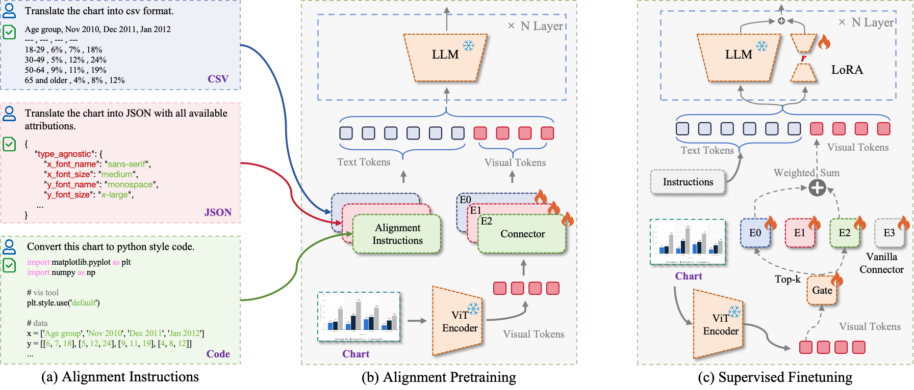

<div>
<h1>Training Recipes of ChartMoE</h1>
</div>

<div align="center">
<h3>Datasets are coming!!!</h3>
</div>

In this part, I'll introduct the training recipes for reproducing ChartMoE. Except for the training recipes, I also provided a checkpoint that can be reproduced according to following instructions. You can find it at [🤗](https://huggingface.co/Coobiw/ChartMoE_Reproduced). **This version has better performance on ChartQA(both with & without PoT).**


## Download InternLM_XComposer2_Enhanced

**Note: I've supported `flash-attn` and `batchified training` for InternLM-XComposer2 on [Coobiw/InternLM-XComposer2_Enhanced](https://huggingface.co/Coobiw/InternLM-XComposer2_Enhanced). This will indeed acclerate training.**

Run:

```bash
cd chartmoe/train
python scripts/internlm_xc2_download.py
```

Then, ChartMoE will appear at `chartmoe/train/ckpt/InternLM-XComposer2_Enhanced`.

## Diversely-Aligned MoE-MLP Training

### Training Pipeline of ChartMoE



Run:

```bash
cd chartmoe/train
bash scripts/multi_align.sh
```

Then, the table/json/code MLP connector will appear at `chartmoe/train/output/{}_proj`.format(table/json/code)!

After diversely alignment, we can construct the MoE-MLP connector by running:

```bash
cd chartmoe/train
bash scripts/moe_construction.sh
```

The MoE-MLP connnector will appear at `chartmoe/train/output/moe_aligned/mlp_moe.pth`.

## SFT

*Note: In this Repo, we don't add "High-Quality Knowledge Learning" mid-training.*

Please notice [the path of MoE-MLP connector](./scripts/sft.sh#L24).

Run:

```bash
cd chartmoe/train
mkdir -p logs/sft
CUDA_VISIBLE_DEVICES=0,1,2,3 bash scripts/sft.sh 2>&1 | tee logs/sft/tee_logs.txt
```

## Merge MLP-MoE Connector and LoRA Weights for ChartMoE Construction
Run:

```bash
cd chartmoe/train
bash scripts/chartmoe_construction.sh
```

## Evaluation on ChartQA
w/o PoT:

```bash
CUDA_VISIBLE_DEVICES=0 python chartmoe/eval_ChartQA.py --ckpt_path chartmoe/train/output/sft/chartmoe_reproduced --save_path chartmoe/train/output/sft/chartmoe_reproduced/ChartQA_wo-PoT
```

Result:
```
+-----------+--------------------+--------+--------+
|    @AP    |        0.05        |  0.1   |  0.2   |
+-----------+--------------------+--------+--------+
|   Human   |       0.7184       | 0.7544 | 0.784  |
| Augmented |       0.9136       | 0.9256 | 0.9392 |
|  Averaged | 0.8160000000000001 |  0.84  | 0.8616 |
+-----------+--------------------+--------+--------+
```

PoT:
```bash
CUDA_VISIBLE_DEVICES=0 python chartmoe/eval_ChartQA.py --ckpt_path chartmoe/train/output/sft/chartmoe_reproduced --save_path chartmoe/train/output/sft/chartmoe_reproduced/ChartQA_PoT --pot --pot_idx 1
```

Result:
```
+-----------+--------+-------+--------+
|    @AP    |  0.05  |  0.1  |  0.2   |
+-----------+--------+-------+--------+
|   Human   | 0.7976 | 0.816 | 0.832  |
| Augmented | 0.912  | 0.924 | 0.9384 |
|  Averaged | 0.8548 |  0.87 | 0.8852 |
+-----------+--------+-------+--------+
```